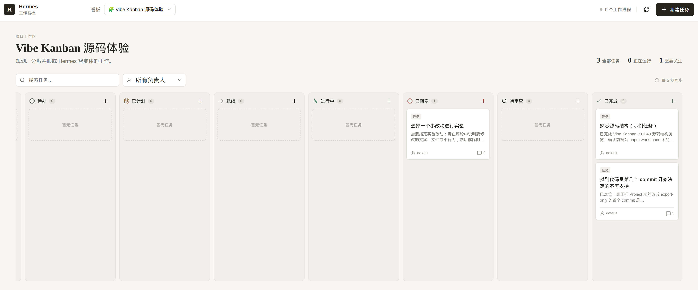

# Hermes Kanban UI
(by GPT 5.6 Sol)

[English](./README.md) | [简体中文](./README.zh-CN.md)

A standalone Kanban interface for Hermes Agent. It exposes only the Kanban API and does not expose the main Hermes dashboard, models, secrets, or configuration pages.

## Preview



## Sandbox setup

Run it as the same OS user as the existing Hermes installation. The backend imports Hermes' official Kanban plugin from `HERMES_SOURCE` and uses the same `HOME`/`HERMES_HOME`, so it sees the existing profiles, board database, and profile credentials.

```bash
command -v hermes
hermes doctor
hermes profile list

cd /worktrees/folder-1/hermes-kanban-ui
npm ci
npm test
npm run build
HERMES_SOURCE=/home/agent/hermes \
HERMES_KANBAN_BOARD=hermes-kanban \
npm start

curl -fsS http://127.0.0.1:8002/api/health
```

For a persistent HighClaws sandbox, put the same start command in `/home/agent/.supervisor/conf.d/hermes-kanban-ui.conf`, then run Supervisor `reread` and `update`.

### Hermes profiles and API access

- Profile names shown by the UI come from the existing Hermes installation. No model credentials are copied into this repository.
- This UI calls the imported local Kanban API directly, so it does **not** need `API_SERVER_KEY`.
- If another trusted server-side integration needs Hermes' OpenAI-compatible HTTP API, enable it on the gateway:

```bash
hermes config set API_SERVER_ENABLED true
API_SERVER_KEY="$(openssl rand -hex 32)"
hermes config set API_SERVER_KEY "$API_SERVER_KEY"
hermes gateway restart
curl -fsS http://127.0.0.1:8642/health
API_SERVER_KEY="$(python3 -c 'import os; print(next(line.split("=",1)[1] for line in open(os.path.expanduser("~/.hermes/.env")) if line.startswith("API_SERVER_KEY=")), end="")')"
curl -H "Authorization: Bearer $API_SERVER_KEY" \
  http://127.0.0.1:8642/v1/models
```

The key is stored in `~/.hermes/.env`. Never commit it, expose it to browser JavaScript, or publish port `8642` directly.

The server binds to `127.0.0.1` by default and does not provide application-level authentication. For remote access, put it behind an authenticated gateway or private tunnel; do not expose it directly.

Environment variables:

- `HERMES_SOURCE`: Hermes source tree. Defaults to `/home/agent/hermes`.
- `HERMES_KANBAN_BOARD`: Board selected by the Hermes Kanban backend.
- `HOME` / `HERMES_HOME`: Select the Hermes installation and profiles to reuse.
- `HOST`: Listening address. Defaults to `127.0.0.1`.
- `PORT`: Listening port. Defaults to `8002`.
